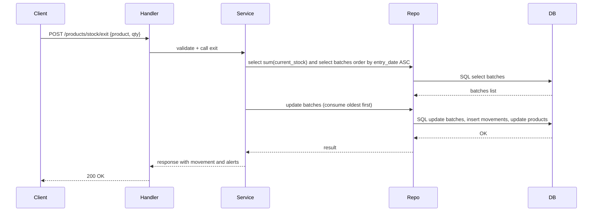
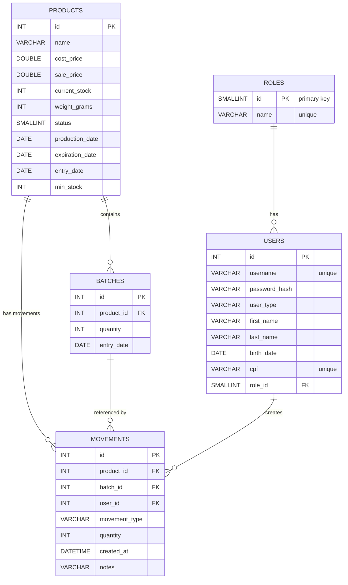

# Documentação Técnica — Gerenciamento de Estoque (UNIFECAF)

Objetivo
--------
Esta documentação tem por objetivo descrever, de forma concisa e prática, a arquitetura, os principais módulos, os fluxos de dados e instruções para desenvolvedores que trabalham no projeto.

Visão geral da arquitetura
--------------------------
O sistema utiliza uma arquitetura em camadas com responsabilidades bem separadas:

- Handlers (HTTP): recebem requests, fazem parsing e chamam serviços.
- Services: aplicam regras de negócio e orquestram operações entre repositórios.
- Repositories: acesso e manipulação do banco de dados (queries SQL usando SQLx).
- Models: estruturas de domínio (Product, User, Movement, Batch).

Fluxo geral de requisição
-------------------------
1. O cliente (frontend ou cliente HTTP) envia uma requisição para a API.
2. O roteador (`routes`) dispara o handler correspondente.
3. O handler valida dados básicos e chama o service apropriado.
4. O service executa regras de negócio e utiliza os repositories para persistência/consulta.
5. O repository executa queries SQL e retorna os resultados.
6. O service monta a resposta e o handler retorna ao cliente.

Resumo das decisões de design
-----------------------------
- Separação clara de responsabilidades para facilitar testes e manutenção.
- SQL explícito nos repositórios (SQLx) para controle fino de consultas e desempenho.
- Alertas como metadados: respostas incluem avisos, mas não bloqueiam operações automaticamente.

Modelos de dados (visão resumida)
--------------------------------
- `roles`:
	- `id` SMALLINT PK
	- `name` VARCHAR(50) UNIQUE

- `users`:
	- `id` INT PK
	- `username` VARCHAR(100) UNIQUE
	- `password_hash` VARCHAR(255)
	- `user_type` ENUM
	- `first_name`, `last_name` VARCHAR(100)
	- `birth_date` DATE
	- `cpf` VARCHAR(14) UNIQUE
	- `role_id` SMALLINT FK -> `roles.id`

- `products`:
	- `id` INT PK
	- `name` VARCHAR(150)
	- `cost_price`, `sale_price` DOUBLE
	- `current_stock` INT
	- `weight_grams` INT
	- `status` SMALLINT
	- `production_date`, `expiration_date`, `entry_date` DATE
	- `min_stock` INT (alert trigger)

- `batches`:
	- `id` INT PK
	- `product_id` INT FK -> `products.id`
	- `quantity` INT
	- `entry_date` DATE

- `movements`:
	- `id` INT PK
	- `product_id`, `batch_id`, `user_id` INT FK
	- `movement_type` ENUM('entrada','saida')
	- `quantity` INT
	- `created_at` DATETIME
	- `notes` VARCHAR(255)

Sequência: Saída de estoque (FIFO)
---------------------------------


Consultas SQL úteis (exemplos)
-----------------------------
1. Total de estoque disponível para um produto:

```sql
SELECT SUM(quantity) as total FROM batches WHERE product_id = ?;
```

2. Buscar lotes ordenados por data de entrada (mais antigos primeiro):

```sql
SELECT * FROM batches WHERE product_id = ? ORDER BY entry_date ASC;
```

3. Inserir movimentação (exemplo):

```sql
INSERT INTO movements(product_id, batch_id, user_id, movement_type, quantity, notes) VALUES(?, ?, ?, 'saida', ?, ?);
```

Testes e validação
------------------
- Recomenda-se criar testes unitários para `services` que encapsulam regras FIFO.
- Testes de integração podem simular a API completa com um banco em memória ou container MySQL.

Deploy e execução em produção (notas)
------------------------------------
- Utilize variáveis de ambiente seguras para `DATABASE_URL`.
- Configure pool de conexões no `config::database` para evitar exaustão de conexões.
- Para produção, rode em modo `release` e exponha apenas as portas necessárias.

Operação e manutenção
---------------------
- Rotina de backup do banco é recomendada (dump diário).
- Monitore `current_stock` e configure alertas operacionais quando `min_stock` for atingido.

Referências
-----------
- Script SQL: `src/database/db_estoque.sql`
- Fluxogramas e fluxos: [docs/FLUXOGRAMA.md](FLUXOGRAMA.md)

## Modelagem do Banco de Dados (ERD)

Abaixo está o diagrama entidade-relacionamento (ERD) gerado a partir do schema em `src/database/db_estoque.sql`. Use este diagrama para entender relações, chaves e multiplicidades.



Resumo dos relacionamentos
- `roles (1) -> users (N)` — cada usuário referencia um role.
- `products (1) -> batches (N)` — cada lote pertence a um produto.
- `products (1) -> movements (N)` — movimentos relacionam-se ao produto.
- `batches (1) -> movements (N)` — movimentos podem referenciar lote (nullable).
- `users (1) -> movements (N)` — movimentos são realizados por um usuário.

Recomendações de índices e constraints
- Index em `products.name` para buscas por nome.
- Index composto em `batches(product_id, entry_date)` para acelerar leituras FIFO.
- Index em `movements(product_id, created_at)` para relatórios.
- Garantir FK com `ON DELETE RESTRICT` ou `ON DELETE SET NULL` conforme política desejada para manter histórico.


Estrutura do repositório
------------------------
- `src/config` — configuração e inicialização (conexão com banco)
- `src/database` — scripts SQL (ex.: `db_estoque.sql`)
- `src/handlers` — controllers HTTP
- `src/services` — lógica de negócio
- `src/repository` — acesso a dados
- `src/models` — structs do domínio
- `src/routes` — definição de rotas da API
- `frontend/` — páginas estáticas e assets

Principais módulos e responsabilidades
-------------------------------------
- `auth_service.rs`: autenticação, hash de senha e geração de tokens (se aplicável).
- `product_service.rs`: criação, atualização e relatórios de produtos.
- `stock_service.rs`: implementação da lógica FIFO para entrada/saída de estoque.
- `user_service.rs`: CRUD de usuários e promoção entre roles.
- `movement_repository.rs`: grava histórico de movimentações.

Banco de dados
-------------
O script de criação do banco de dados está em `src/database/db_estoque.sql`. As tabelas principais são:
- `roles` — perfis de acesso
- `users` — usuários do sistema
- `products` — cadastro de produtos
- `batches` — lotes (usados para FIFO)
- `movements` — histórico de entradas/saídas

Regras e decisões de design importantes
------------------------------------
- FIFO por lote: cada `entrada` cria ou atualiza um lote com `entry_date`; a `saída` consome lotes do mais antigo ao mais novo.
- Alertas não bloqueantes: avisos de estoque baixo e consumo elevado são retornados como metadados na resposta, sem impedir a operação.
- Separação clara entre validação (validators), orquestração (services) e persistência (repositories).

Endpoints principais (resumo)
----------------------------
- `POST /login`, `POST /register` — autenticação
- `GET /products`, `POST /products/create` — produtos
- `POST /products/stock/entry`, `POST /products/stock/exit` — movimentação de estoque (FIFO)
- `GET /reports/*` — relatórios e alertas

Fluxos críticos descritos
------------------------
Autenticação

1. `POST /login` com `username` e `password`.
2. `auth_service` valida credenciais (comparação de hash) e retorna token/session.

Saída de estoque (FIFO)

1. Recebe `product_name` e `quantity`.
2. `stock_service` soma estoque disponível; se insuficiente, retorna erro.
3. Ordena os lotes (`batches`) por `entry_date ASC`.
4. Consome lotes em ordem até satisfazer a quantidade, decrementando `quantity` e atualizando `batches` e `products.current_stock`.
5. Registra movimentação em `movements` com referência aos lotes usados.
6. Retorna aviso de estoque baixo ou alerta de consumo quando aplicável.

Front-end
---------
O front-end é uma coleção de páginas estáticas em `frontend/` que consomem a API via `js/api.js`. Não há build toolchain complexa (ex.: Webpack); a entrega é feita como assets estáticos.

Como contribuir (prático)
------------------------
1. Abra uma branch com nome claro (`feature/`, `fix/`, `docs/`).
2. Rode os testes locais (quando adicionados) e valide endpoints manualmente.
3. Abra um PR com descrição das mudanças e um resumo técnico.

Checklists rápidas para PRs
--------------------------
- Código compilando (cargo build)
- Nenhuma mudança de contrato de API sem migração/documentação
- Mensagens de commit curtas e claras

Referências
-----------
- Script SQL: `src/database/db_estoque.sql`

Contato
-------
Para dúvidas sobre a arquitetura ou decisões de implementação, fale com os desenvolvedores do projeto.
