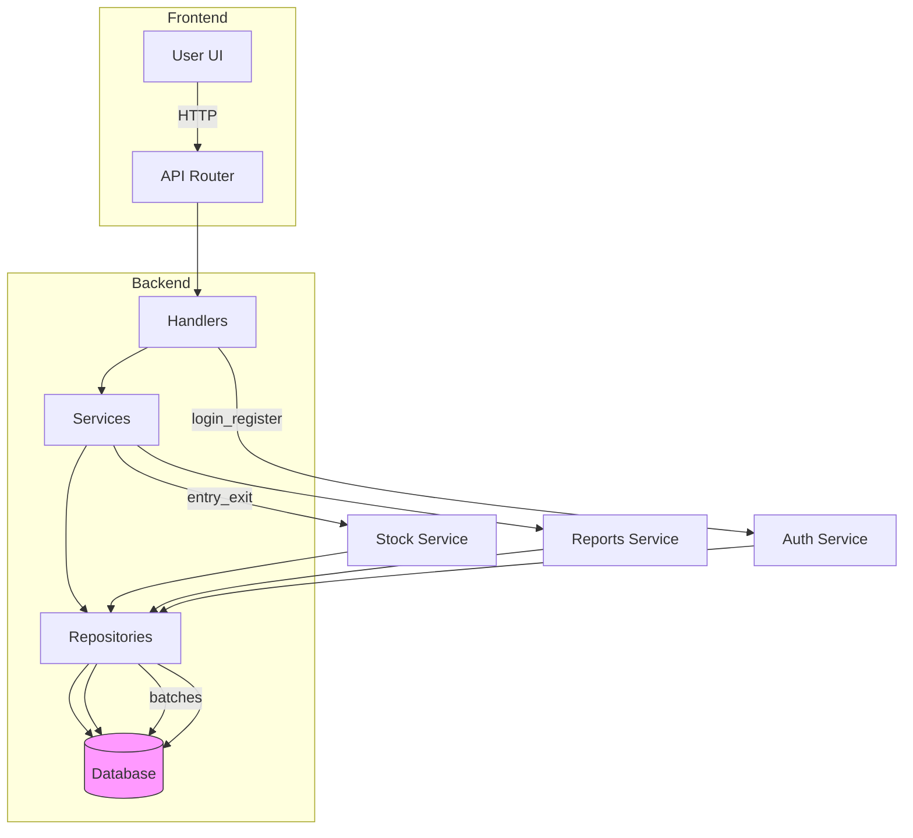
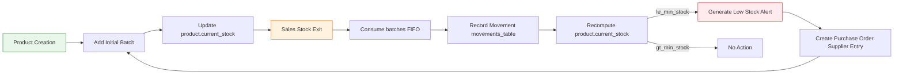

# Fluxograma do Projeto

Diagrama ilustrando a arquitetura e os fluxos principais (autenticação e fluxo FIFO de estoque).

Observações:
- O diagrama foca na separação de responsabilidades: apresentação → handlers → serviços → repositórios → banco.
- Para o fluxo FIFO, os `repositories` consultam `batches` ordenados por `entry_date` e atualizam as quantidades conforme consumo.

## Product Management Workflow

Diagrama e passos práticos que descrevem o ciclo de vida de um produto dentro do sistema (criação, entradas, consumo por vendas/saídas, monitoramento e reabastecimento).

Passos (descrição humana e objetiva):

- **Criação do produto**: o usuário cadastra o produto via `POST /products/create`, fornecendo preços, datas e `min_stock`.
- **Entrada inicial / lote**: ao cadastrar ou receber mercadoria, um lote (`batches`) é criado com `entry_date` e `quantity` — isso alimenta o controle FIFO.
- **Atualização de estoque**: `product.current_stock` é incrementado quando lotes são adicionados; essa é a fonte rápida de consulta de disponibilidade.
- **Saída (venda/consumo)**: quando ocorre uma saída (`POST /products/stock/exit`), o `stock_service` valida quantidade e consome lotes mais antigos primeiro, atualizando `batches` e `products.current_stock`.
- **Registro**: cada operação gera um registro em `movements` com referência ao(s) lote(s) afetado(s) para auditoria.
- **Monitoramento e alerta**: após atualização, o sistema compara `current_stock` com `min_stock`. Se estiver abaixo ou igual, gera um **aviso de estoque baixo** e sinaliza reabastecimento.
- **Reabastecimento**: o processo de reabastecimento pode ser manual (usuário registra nova entrada) ou automatizado (criação de pedido de compra). Quando novas entradas chegam, novos lotes são criados e o ciclo recomeça.

Notas práticas

- Mantenha `min_stock` realista por produto — ele é o gatilho do fluxo de alerta.
- Registre sempre `notes` nas `movements` para facilitar auditoria (quem solicitou, notas da operação, fornecedor).
- O uso de `batches` permite rastrear validade/produção por lote; preserve `entry_date` e `expiration_date` quando aplicável.

